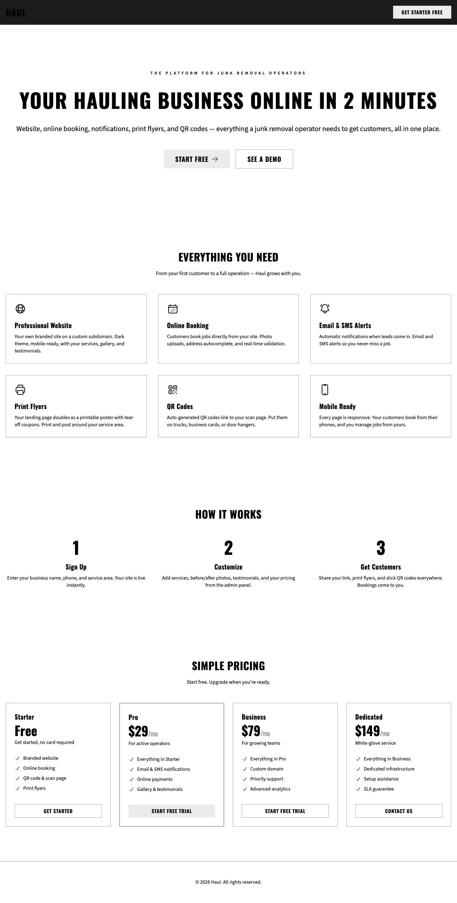

# Product Walkthrough — 2026-03-09

## Executive summary

Haul is a fully functional multi-tenant SaaS platform for junk removal operators. The product delivers a complete operator toolkit: marketing landing page with pricing, self-service signup, AI-powered conversational onboarding, professional tenant websites (landing, scan/gallery, booking with photo upload and address autocomplete), email + SMS notifications, Stripe payments + subscription billing, content admin panel, custom domain support, and print-ready flyers with QR codes. 742 ExUnit tests pass with 0 failures across 85 test files. 15 Playwright/browser QA tickets verified every implemented page. The platform is deployable on Fly.io and supports schema-per-tenant multi-tenancy via AshPostgres.

## Test results summary

| Area | ExUnit tests | Playwright QA ticket | QA status |
|------|-------------|---------------------|-----------|
| Landing page (platform marketing) | PageController tests | T-002-04 | ✅ Pass |
| Booking form | BookingLive tests | T-003-04 | ✅ Pass |
| Scan page + gallery | ScanLive + QR tests (26) | T-005-04 | ✅ Pass |
| Content domain | Content resource + loader (135) | T-006-05 | ✅ Pass |
| Notifications (email + SMS) | Worker + template tests | T-007-05 | ✅ Pass |
| Payments | PaymentLive + webhooks (19) | T-008-04 | ✅ Pass |
| Address autocomplete | Places + autocomplete (17) | T-009-03 | ✅ Pass |
| Tenant routing | Resolver + hook + isolation (29) | T-012-05 | ✅ Pass |
| Content admin UI | Admin LiveView tests (50) | T-013-06 | ✅ Pass (1 bug fixed) |
| CLI onboarding | Onboarding QA tests (10) | T-014-03 | ✅ Pass |
| Self-service signup | Signup flow tests (14) | T-015-04 | ✅ Pass (1 bug fixed) |
| Subscription billing | Billing QA tests (16) | T-016-04 | ✅ Pass |
| Custom domains | Domain QA tests (14) | T-017-03 | ✅ Pass |
| Chat onboarding | Chat QA tests (25) | T-019-06 | ✅ Pass |
| AI provision pipeline | Provision QA tests (14) | T-020-05 | ✅ Pass |

**Totals:** 742 ExUnit tests (0 failures, 1 excluded) · 15 browser QA tickets (all pass) · 85 test files

## Visual walkthrough

### Platform landing page (`/`)

- **What's here:** Full marketing landing page with hero ("Your Hauling Business Online in 2 Minutes"), 6-feature grid (Professional Website, Online Booking, Email & SMS Alerts, Print Flyers, QR Codes, Mobile Ready), 3-step How It Works, 4-tier pricing (Starter free, Pro $29/mo, Business $79/mo, Dedicated $149/mo), footer.
- **What's tested:** T-002-04 verified all sections, CTAs, mobile responsive. PageController unit tests.
- **What's missing:** No A/B testing or analytics. "See a Demo" links to /app/signup (no separate demo flow).
- **Design:** Dark theme (pure grayscale), Oswald headings, Source Sans 3 body. Clean, professional layout.

### Scan page (`/scan`)

- **What's here:** LiveView page with hero (business name, phone CTA), gallery with before/after items, endorsements with star ratings, footer CTA.
- **What's tested:** T-005-04 verified all sections, T-006-05 verified content rendering. 26 ExUnit tests.
- **What's missing:** Gallery images 404 in dev (expected — no actual image files in dev). Gallery fallback inconsistency on mobile noted as pre-existing.

### Booking form (`/book`)

- **What's here:** LiveView form with name, phone, email, address (with autocomplete), description, photo upload, preferred date/time. Real-time validation. Confirmation screen on submit.
- **What's tested:** T-003-04 full happy path + validation. T-009-03 address autocomplete (dropdown, keyboard nav, ARIA). Combined ~40 tests.
- **What's missing:** No payment integration on booking form itself (separate `/pay/:job_id` page).

### QR code (`/scan/qr`)

- **What's here:** SVG download endpoint — generates a QR code linking to the scan page. Used for flyers, business cards, truck decals.
- **What's tested:** QRController tests (10 tests). Browser QA verified download triggers.
- **Screenshot:** Not captured (endpoint triggers file download, not a page).

### Chat onboarding (`/start`)

- **What's here:** LiveView chat interface with welcome message, text input, profile sidebar. AI-powered conversation extracts business info (name, phone, email, area, services, differentiators) and populates profile panel in real-time. Provisioning flow creates tenant + generates content.
- **What's tested:** T-019-06 (25 tests): UI layout, conversation flow, streaming UX, profile panel, mobile toggle, provisioning, persistence, error recovery, rate limiting. Total 41 chat tests.
- **What's missing:** Requires BAML/LLM configuration for real AI responses (sandbox in test). Conversation persistence bug: AppendMessage uses stale struct, only last-persisted message survives reconnection.

### Signup form (`/app/signup`)

- **What's here:** LiveView form for self-service operator signup. Business name, slug (with real-time preview), email, password. Creates Company + tenant + seeds content.
- **What's tested:** T-015-04 (14 tests): marketing CTAs, form validation, full signup flow, onboarding wizard, tenant rendering, mobile responsive.
- **What's missing:** Post-signup redirects to /app (not /app/onboarding directly).

### Login (`/app/login`)

- **What's here:** Simple email + password form. Authenticates via AshAuthentication JWT tokens.
- **What's tested:** T-013-06 verified login flow. Bug found and fixed: LoginLive tenant key mismatch (session["tenant"] vs session["tenant_slug"]).
- **What's missing:** No "Forgot password" link (password reset emails are TODOs in user.ex). No magic link option yet.

### Admin dashboard (`/app`)

- **What's here:** Sidebar navigation (Dashboard, Content, Bookings, Settings), welcome message with operator email, site URL link, theme toggle (system/light/dark).
- **What's tested:** T-013-06 verified dashboard loads with company name, user email, sidebar nav, theme toggle.
- **What's missing:** No analytics widgets, job count, or revenue summary. Dashboard is informational only.

### Site settings (`/app/content/site`)

- **What's here:** Form editor for business info (name, tagline, phone, email), location (address, service area), appearance (primary color). Changes take effect immediately on public pages.
- **What's tested:** T-013-06 verified form load, edit, save, and public page reflection. 50 admin tests total.

### Services editor (`/app/content/services`)

- **What's here:** CRUD list of services with title, description, icon. Add/edit/delete/reorder.
- **What's tested:** T-013-06 verified services page with 6 seeded items. ServicesLive tests.

### Gallery manager (`/app/content/gallery`)

- **What's here:** CRUD grid of gallery items with before/after image pairs. Upload, caption, reorder.
- **What's tested:** T-013-06 verified gallery page with items. GalleryLive tests.

### Billing settings (`/app/settings/billing`)

- **What's here:** Subscription tier cards (Starter, Pro, Business, Dedicated) with current plan indicator, upgrade/downgrade buttons, feature comparison.
- **What's tested:** T-016-04 (16 tests): tier rendering, upgrade flow, downgrade, feature gates, dunning alerts, auth guard. Combined 27 billing tests.
- **What's missing:** Stripe Checkout page is external (sandbox returns immediately in test).

### Domain settings (`/app/settings/domain`)

- **What's here:** Custom domain configuration with CNAME instructions, DNS verification status, provisioning states (pending → provisioning → active).
- **What's tested:** T-017-03 (14 tests): tier gating, domain lifecycle, validation, removal, PubSub status updates. Combined 30 domain tests.
- **What's missing:** Actual DNS verification only tests error path (no real CNAME in test).

### Print view

- **What's here:** Platform landing page with print media emulation. Note: The operator-specific tenant landing page (with tear-off coupon strip) is rendered at the tenant subdomain, which cannot be accessed via localhost.
- **What's tested:** T-002-04 noted print layout verification not possible via accessibility snapshots. The print stylesheet with tear-off coupons is implemented but only visible on tenant-specific landing pages.

## Bugs found during QA

| Bug | Found in | Status | Notes |
|-----|----------|--------|-------|
| Dev server 500 on stale config | T-002-04 | Fixed | Server restart resolved it |
| Missing tenant schema on fresh book | T-003-04 | Fixed | Requires tenant provisioning |
| Gallery fallback inconsistency on mobile | T-005-04 | Pre-existing | Not a functional blocker |
| No markdown page route | T-006-05 | N/A | Feature not in scope |
| Oban startup fragility (migrations) | T-007-05 | Pre-existing | Can start without migrations, then fail |
| Dropdown re-show after autocomplete select | T-009-03 | Minor UX | User naturally blurs by clicking next field |
| LoginLive tenant key mismatch | T-013-06 | **Fixed** | Code change in login_live.ex |
| Rate limiter ETS contamination in tests | T-015-04 | **Fixed** | Added clear_rate_limits helper |
| AppendMessage stale struct (persistence) | T-019-06 | Pre-existing | Only last-persisted message survives reconnect |

## Architectural decisions

- **No LiveView for landing page** — server-rendered via PageController for fast first paint
- **Operator config via `config.exs`** — business defaults overridable at runtime via env vars
- **Haul.Cldr module** — required by ex_money/ash_money, not in original spec
- **daisyUI themes disabled, custom grayscale** — dark/light via `[data-theme]` + localStorage toggle
- **Print layout: tear-off coupon strip** — 8 vertical coupons with phone number on tenant landing
- **Scan page uses LiveView** — ScanLive for dynamic gallery content
- **Booking uses LiveView** — BookingLive with real-time validation, creates Job in :lead state
- **Content resources defined in Ash** — SiteConfig, Service, GalleryItem, Endorsement, Page
- **MDEx for Markdown rendering** — content pages rendered server-side, no client-side JS
- **Oban for async notifications** — booking emails and SMS via Oban workers, not inline
- **Tenant resolver uses subdomain extraction** — base_domain config determines subdomain parsing
- **Sentry logger handler** — wired in Application.start/2, captures logged errors
- **BAML content generation uses Claude Haiku** — four separate functions for cost efficiency
- **Chat fallback uses Chat.configured?/0** — silent redirect to signup if LLM unavailable
- **Schema-per-tenant** — AshPostgres `:context` strategy, set up before domain resources
- **No separate frontend** — Tailwind + esbuild via Mix tasks, no node_modules

## Coverage gaps

| Area | ExUnit | Browser QA | Gap |
|------|--------|-----------|-----|
| Operator tenant landing page | ✅ | ✅ (T-002-04) | Playwright screenshots are marketing page only (subdomain N/A on localhost) |
| Print stylesheet | ✅ | ❌ | Print media only visible on tenant pages; accessibility snapshots can't verify |
| Stripe Payment Element | ✅ unit | ❌ | Cross-origin iframe prevents browser automation |
| Stripe Checkout flow | ✅ unit | ❌ sandbox | Real Stripe Checkout is external |
| Subdomain routing (browser) | ✅ ExUnit | ❌ | DNS limitations prevent browser testing; code-tested only |
| Custom domain routing (browser) | ✅ ExUnit | ❌ | DNS limitations prevent browser testing; code-tested only |
| Password reset / magic link | ❌ | ❌ | Email senders are TODOs in user.ex |
| Mobile admin pages | ❌ | ❌ | Admin screenshots desktop-only (sidebar collapses on mobile, not captured) |
| Content page routes | ❌ | ❌ | MDEx markdown pages have no route defined |
| Endorsements admin | ✅ ExUnit | ✅ (T-013-06) | Manual Playwright not captured (covered in T-013-06) |
| Onboarding wizard | ✅ (14 tests) | ✅ (T-015-04) | Screenshots in T-015-04 work dir |

## Recommendations

1. **Password reset flow** — user.ex has TODO stubs for password reset and magic link emails. This blocks any self-service password recovery. Implement before production launch.

2. **Conversation persistence bug** — AppendMessage uses stale struct, so only the last-persisted message survives browser reconnection. This is a data loss issue in the chat onboarding flow. Fix in T-019 scope.

3. **Post-signup redirect** — Currently redirects to /app instead of /app/onboarding. New operators must find the onboarding wizard manually. Simple fix: redirect to /app/onboarding after signup.

4. **Oban migration guard** — Oban can start before migrations are applied, causing silent failures. Add a migration check to Application.start/2 or mix setup.

5. **Gallery images in dev** — All gallery items 404 in development (no actual image files). Consider adding placeholder images to priv/static for local development.

6. **Mobile admin screenshots** — The admin panel has responsive design (hamburger menu verified in T-013-06) but no mobile screenshots were captured in this walkthrough. Consider adding if mobile admin is a priority.

7. **Markdown content pages** — Content domain supports MDEx-rendered pages but no route exists for them. Either add a route or remove the Page resource if not needed.

8. **business_name not set by CLI onboarding** — `mix haul.onboard` doesn't update SiteConfig.business_name, leaving it as "Your Business Name". The onboarding task should set this from the --name flag.

9. **Docker image size** — 278MB vs 100MB target. Ash ecosystem is the primary contributor. Acceptable for now but worth revisiting if deploy times become an issue.

10. **Test performance** — 742 tests take 186.6s (185.8s sync). Consider async test strategies or test partitioning for faster CI feedback.
